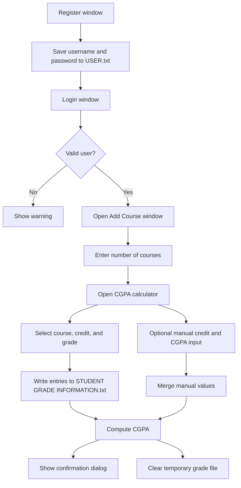

<div align="center">


<h1>CGPA Calculator</h1>

<p>JavaFX desktop application for computing a student's CGPA from locally captured course-credit and grade-point records.</p>

<p>


</p>
</div>

## Overview

`CGPA Calculator` is a Java 8 and JavaFX desktop app for local CGPA calculation. It uses a simple register/login flow and stores temporary course data in project-root text files. The app computes `CGPA = Σ(Credit × Grade Point) / Σ(Credit)` and validates duplicate, empty, and invalid inputs.


## Table of Contents

- 🚀 Project intro
- 📁 Project structure
- ⭐ Differentiators
- 🔧 Features
	- Flow diagram
	- Login and file flow
- 🧰 Tech stack
- ⚙️ Install methods
	- 📦 Eclipse / Java 8
	- 🧹 Resetting local data
- 💾 Local file settings
- 🗄️ Local file structure
- 📜 Available scripts
- 🚀 Deployment notes
- 🤝 Contributing
- 📄 License


## 🚀 Project intro

`CGPA Calculator` is a Java 8 and JavaFX desktop application that implements a local, file-backed workflow for collecting student course data and deriving a final CGPA score.

The application authenticates users through a lightweight register/login flow, captures course count and course-level grade input through JavaFX forms, and persists intermediate values in plain-text files under the project root. The calculator then evaluates the weighted-average GPA formula:

CGPA = Σ(Credit × Grade Point) / Σ(Credit)

Grade-point mapping follows the North South University scale, and the computed result is returned in the UI with validation dialogs for duplicate, empty, or invalid input states.


## 📁 Project structure

```text
CGPA-CALCULATOR/
├── build.fxbuild
├── LICENSE
├── README.md
├── USER.txt
├── bin/
│   ├── application/
│   │   └── application.css
│   └── Image/
└── src/
	└── application/
		├── AddCourse.java
		├── application.css
		├── CgpaCalculator.java
		├── Login.java
		├── Register.java
		└── Image/
```


## ⭐ Differentiators

• Built as a lightweight JavaFX desktop app with no external server or database setup.
• Uses a simple login and registration flow backed by a local text file.
• Includes a predefined course list and grade list aligned with the calculator workflow.
• Supports manual credit and CGPA input for cases that need an extra adjustment.
• Clears temporary grade data after calculation so the next session starts cleanly.


## 🔧 Features

### Core features

| Feature | Status | Details |
| --- | --- | --- |
| Login and registration | Current | Register new users and log in with locally stored credentials. |
| Course entry flow | Current | Enter the number of courses before opening the CGPA calculator. |
| Course selection | Current | Choose course code, credit, and grade from predefined lists. |
| Manual adjustment | Current | Add manual credit and CGPA values when needed. |
| CGPA calculation | Current | Calculates total credits and CGPA from all entered records. |
| Validation dialogs | Current | Warns on empty input, duplicates, and invalid credential checks. |


### Flow diagram

The diagram below shows the main application journey from login or registration through course entry and CGPA calculation.




### Login and file flow

• `Login.java` reads `USER.txt` and validates the entered username and password.
• `Register.java` creates new user entries in `USER.txt` after checking for duplicates and basic length rules.
• `AddCourse.java` asks for the number of courses and resets the temporary grade file before launching the calculator.
• `CgpaCalculator.java` records the selected course, credit, and grade data, then computes the final CGPA when the user clicks calculate.


## 🧰 Tech stack

• Language: Java 8
• UI: JavaFX
• IDE setup: Eclipse with e(fx)clipse / JavaFX container support
• Storage: Plain-text local files
• Build metadata: Eclipse FX build file (`build.fxbuild`)


## ⚙️ Install methods

### 📦 Eclipse / Java 8

Prerequisites:

• Java 8
• Eclipse IDE with JavaFX support

1. Clone or copy the project into your workspace.
2. Import it into Eclipse as an existing Java project.
3. Make sure the project is using `JavaSE-1.8` and has the JavaFX container configured.
4. Run `application.Login` as the main application.
5. Register a user, log in, enter the number of courses, and use the calculator window.


### 🧹 Resetting local data

To clear saved project data:

• Delete `USER.txt` if you want to remove all locally stored accounts.
• Remove `STUDENT GRADE INFORMATION.txt` if you want to clear any leftover course entries.
• The application also clears the temporary grade file after each successful calculation.


## 💾 Local file settings

This project does not use environment variables.

Instead, it relies on writable files in the project root for credential storage and temporary calculator data.


## 🗄️ Local file structure

Files written or read by the application:

• `USER.txt` stores username and password pairs separated by spaces.
• `STUDENT GRADE INFORMATION.txt` stores course, credit, and grade entries while the calculator is running.

Notes:

• Credentials are stored in plain text, so the project is intended for local/demo use.
• `STUDENT GRADE INFORMATION.txt` is treated as temporary session data and is cleared after calculation.


## 📜 Available scripts

This repository does not define package-manager scripts.

The project is designed to be opened and run from Eclipse, using `application.Login` as the entry point.


## 🚀 Deployment notes

• This is a desktop JavaFX application, not a hosted web deployment.
• The `build.fxbuild` file shows that the project was set up with Eclipse FX tooling.
• Keep the application directory writable because the app creates and updates local text files at runtime.
• If you package the app for distribution, make sure the JavaFX runtime is available on the target machine.


## 🤝 Contributing

• Fork the repository and create a focused feature branch.
• Keep changes small and easy to verify.
• Do not commit real credentials or personal data in the local text files.


## 📄 License

This project is licensed under the MIT License. See the `LICENSE` file for details.
